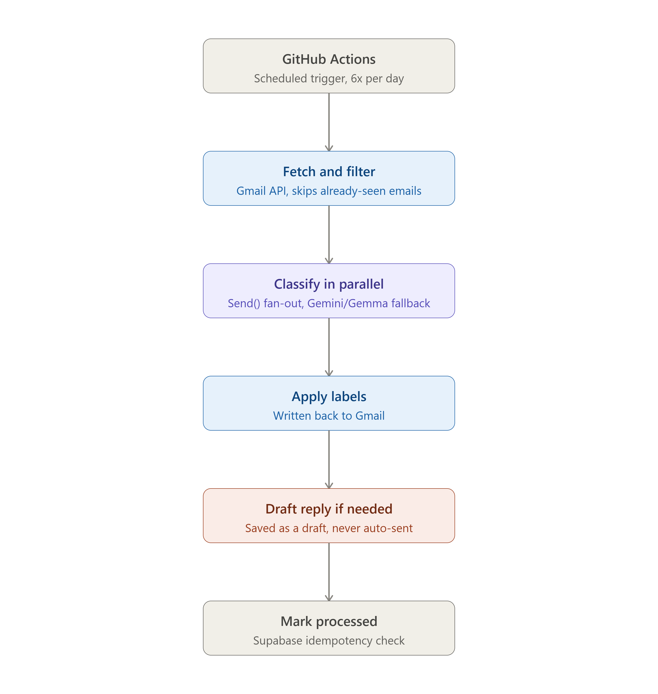

# 📧 Email Agent — Autonomous Gmail Triage with LangGraph


## 📸 Demo


An autonomous AI agent that reads your Gmail inbox, classifies emails across 20+ real-world categories, applies labels automatically, and drafts replies for human review — running on a **fully automated, zero-cost schedule** via GitHub Actions.

Built as a personal solution to a real problem: commercial AI email tools (Gemini for Workspace, Copilot, etc.) cap free-tier usage too aggressively for daily inbox management. This agent runs entirely on free-tier infrastructure, indefinitely.

---

## 🎯 Why This Exists

Job hunting and daily inbox triage generate a constant stream of job alerts, course updates, recruiter messages, and the occasional genuinely urgent email that needs a fast reply. Manually sorting this every day is repetitive and easy to fall behind on.

This agent automates the sorting, surfaces what's actually important, and drafts replies for anything that needs a response — while keeping a human firmly in the loop before anything is ever sent.

---

## ✨ Features

- **Multi-label classification** — 21 categories covering jobs, education, finance, urgency, and more (see full list below)
- **Real Gmail labels** — classifications are written back as actual, visible Gmail labels, auto-created on first use
- **Human-in-the-loop drafting** — the agent writes reply drafts for emails needing a response, saved directly to Gmail's Drafts folder. **It never auto-sends.** You review, edit, and send manually
- **Idempotent by design** — a Supabase-backed tracking layer ensures no email is ever reclassified or re-drafted across runs, even if a run partially fails
- **Multi-model rate-limit resilience** — automatically falls back across multiple free-tier Gemini/Gemma models if one hits its quota, since each model has an independent rate limit
- **Fully autonomous scheduling** — runs 6x/day via GitHub Actions, at zero cost, with no server to maintain

---

## 🏷️ Classification Labels

The agent classifies each email into one or more of the following:

**Career:** `Job-Alert`, `Application-Update`, `Shortlisted`, `Interview-Invite`, `Rejection`, `Offer`, `Recruiter-Outreach`
**Education:** `Course-Update`, `Education-Opportunity`, `Webinar-Event`
**Finance:** `Subscription-Expiring`, `Billing-Invoice`, `Finance-Alert`
**Urgency:** `Urgent-Reply-Needed`, `Needs-Reply`, `Deadline-Reminder`
**General:** `Personal`, `Newsletter`, `Promotional`, `Spam`, `Other`

Emails can carry multiple labels — e.g., a shortlisting email might be tagged both `Shortlisted` and `Urgent-Reply-Needed`.

---
## 🏗️ Architecture



The agent runs as a scheduled LangGraph pipeline: fetching unread emails, classifying them in parallel across a multi-model fallback chain, applying Gmail labels, drafting replies only where genuinely needed, and recording state in Supabase for idempotency across runs.


**Key LangGraph patterns used:**

| Pattern | Where | Why |
|---|---|---|
| `Send()` fan-out | Classification, drafting | Parallel per-email processing instead of sequential |
| Conditional edges | `needs_reply` routing | Only drafts replies where genuinely needed |
| State reducers | `Annotated[list, add]` | Merges parallel `Send()` outputs safely |
| Human-in-the-loop | Draft-only, never auto-send | Keeps a human decision point before any email leaves the inbox |
---

## 🛠️ Tech Stack

| Layer | Technology |
|---|---|
| Agent orchestration | LangGraph |
| LLM | Google Gemini / Gemma (multi-model fallback chain) |
| Email | Gmail API (OAuth2, refresh-token flow) |
| Persistence | Supabase (Postgres) |
| Deployment | GitHub Actions (scheduled cron, zero cost) |
| Language | Python 3.11 |

---

## 📂 Project Structure

```text
Email Agent/
├── main.py                    # Entry point
├── requirements.txt
├── src/
│   ├── auth/
│   │   └── gmail_auth.py      # OAuth refresh-token flow
│   ├── gmail/
│   │   ├── fetch.py           # Fetch + parse unread emails
│   │   ├── labels.py          # Apply Gmail labels
│   │   └── drafts.py          # Create threaded Gmail drafts
│   ├── llm/
│   │   ├── client.py          # Multi-model fallback LLM client
│   │   └── prompts.py         # Classification + draft prompts
│   ├── graph/
│   │   ├── state.py           # LangGraph state schema
│   │   ├── nodes.py           # All graph nodes
│   │   ├── edges.py           # Send() routing logic
│   │   └── build_graph.py     # Compiled graph
│   └── storage/
│       └── processed_store.py # Supabase idempotency layer
└── .github/workflows/
    └── email_agent.yml        # Scheduled GitHub Actions workflow
```

---

## 🚀 Setup (If You Want to Run This Yourself)

### 1. Prerequisites
- Python 3.11+
- A Google Cloud project with Gmail API enabled
- A Google AI Studio API key (Gemini/Gemma)
- A free Supabase account

### 2. Clone the Repo
```bash
git clone https://github.com/Jawad-Emre/Agentic-Ai-Projects.git
cd "Agentic-Ai-Projects/Email Agent"
```

### 3. Install Dependencies
```bash
python -m venv venv
venv\Scripts\activate     # Windows
pip install -r requirements.txt
```

### 4. Set Up Google OAuth
1. Create a project in [Google Cloud Console](https://console.cloud.google.com/)
2. Enable the Gmail API
3. Configure the OAuth consent screen (add yourself as a test user, or publish the app)
4. Create OAuth credentials (Desktop app type), download `credentials.json` into this folder

### 5. Generate a Refresh Token
```bash
python token_generation.py
```
This opens a browser for one-time authorization and prints your refresh token.

> **Note:** Unverified Google apps issue refresh tokens that expire every 7 days. This is a known limitation for personal-use OAuth apps without full Google verification.

### 6. Set Up Supabase
1. Create a project at [supabase.com](https://supabase.com)
2. Create a table named `processed_emails` with columns: `id` (text, primary key), `processed_at` (timestamptz, default `now()`)
3. Copy your Project URL and Secret API key

### 7. Configure Environment Variables
Create a `.env` file:
```env
GMAIL_CLIENT_ID=your_client_id
GMAIL_CLIENT_SECRET=your_client_secret
GMAIL_REFRESH_TOKEN=your_refresh_token
GOOGLE_API_KEY=your_gemini_api_key
SUPABASE_URL=your_supabase_url
SUPABASE_KEY=your_supabase_secret_key
```

### 8. Run Locally
```bash
python main.py
```

### 9. Deploy (Optional — Automated Scheduling)
1. Push this repo to your own GitHub
2. Add all 6 environment variables above as **GitHub repo secrets** (Settings → Secrets and variables → Actions)
3. The included `.github/workflows/email_agent.yml` will run automatically on schedule — no server needed

---

## ⚠️ Known Limitations

- **7-day token expiry** — unverified Google OAuth apps require re-authorization weekly. A quick manual `token_generation.py` re-run + secret update is needed periodically.
- **Free-tier rate limits** — heavy inbox volume can occasionally exhaust all fallback models in a single run; unclassified emails default to a safe `Other` label rather than failing the whole batch.
- **No auto-send** — by design. This agent will never send an email without you manually clicking send in Gmail.

---

## 📄 License

MIT — free to use, modify, and learn from.

---

## 🙋 About This Project

Built as a hands-on project to learn LangGraph's core patterns: parallel execution via `Send()`, conditional routing, state reducers, and human-in-the-loop design — applied to a real, personally useful problem rather than a toy example.