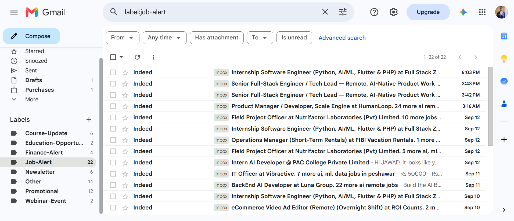
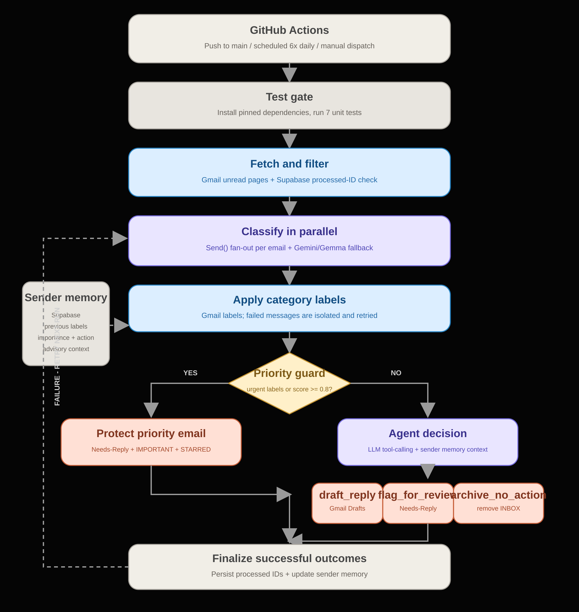

# 📧 Email Agent — Autonomous Gmail Triage with LangGraph


## 📸 Demo



An autonomous AI agent that reads your Gmail inbox, classifies emails across 20+ real-world categories, applies labels automatically, and drafts replies for human review — running on a **fully automated, zero-cost schedule** via GitHub Actions.

Built as a personal solution to a real problem: commercial AI email tools (Gemini for Workspace, Copilot, etc.) cap free-tier usage too aggressively for daily inbox management. This agent runs entirely on free-tier infrastructure, indefinitely.

---

## 🎯 Why This Exists

Job hunting and daily inbox triage generate a constant stream of job alerts, course updates, recruiter messages, and the occasional genuinely urgent email that needs a fast reply. Manually sorting this every day is repetitive and easy to fall behind on.

This agent automates the sorting, surfaces what's actually important, and drafts replies for anything that needs a response — while keeping a human firmly in the loop before anything is ever sent.

---

## ✨ Features

- **Multi-label classification** — 21 categories covering jobs, education, finance, urgency, and more
- **Real Gmail labels** — classifications are written back as actual, visible Gmail labels, auto-created on first use
- **Genuine agentic decision-making** — an LLM bound with real tools (`draft_reply`, `flag_for_review`, `archive_no_action`) reasons about each email and chooses the action itself, not a hardcoded rule
- **Deterministic priority protection** — high-stakes emails (interviews, offers, finance alerts, high importance score) are never left to LLM discretion; they're always flagged for human attention
- **Human-in-the-loop drafting** — reply drafts are saved directly to Gmail's Drafts folder. **The agent never auto-sends.** You review, edit, and send manually
- **Real archiving** — the `archive_no_action` path genuinely removes handled emails from the inbox via the Gmail API, not just a logged intention
- **Prompt injection guards** — untrusted email content is explicitly boundaried in every prompt, reducing the risk of an email's content hijacking the agent's behavior
- **Retry-safe idempotency** — a Supabase-backed tracking layer ensures no email is reclassified or re-drafted across runs, and failed actions are automatically retried rather than silently lost
- **Sender memory** — the agent remembers the latest labels, importance, and action for each sender and supplies that context during future decisions
- **Multi-model rate-limit resilience** — automatically falls back across 4 independent free-tier Gemini/Gemma quotas
- **Fully autonomous scheduling** — runs 6x/day via GitHub Actions on a schedule, plus automatically on every push to catch up on the latest code immediately

---

## 🏷️ Classification Labels

The agent classifies each email into one or more of the following:

**Career:** `Job-Alert`, `Application-Update`, `Shortlisted`, `Interview-Invite`, `Rejection`, `Offer`, `Recruiter-Outreach`
**Education:** `Course-Update`, `Education-Opportunity`, `Webinar-Event`
**Finance:** `Subscription-Expiring`, `Billing-Invoice`, `Finance-Alert`
**Urgency:** `Urgent-Reply-Needed`, `Needs-Reply`, `Deadline-Reminder`
**General:** `Personal`, `Newsletter`, `Promotional`, `Spam`, `Other`

Emails can carry multiple labels — e.g., a shortlisting email might be tagged both `Shortlisted` and `Urgent-Reply-Needed`.

---
## 🏗️ Architecture



The agent runs as a scheduled LangGraph pipeline with a genuine agentic decision core: after classification and labeling, an LLM is given real tools and **decides for itself** which action fits each email — this isn't a hardcoded if/else, the model actively reasons and calls a tool via LangChain's function-calling interface. A deterministic safety net protects high-stakes emails from being left to the model's discretion entirely.

1. **Fetch Unread** — Pulls unread emails from Gmail via the Gmail API, with pagination to handle inboxes larger than a single API page
2. **Filter Seen** — Checks Supabase to skip emails already processed in a prior run
3. **Classify** — Each email is classified in parallel (`Send()` fan-out) across 21 labels, an importance score, and a `needs_reply` flag, using a Gemini/Gemma fallback chain across 4 independent free-tier quotas
4. **Apply Labels** — Classification results are written back as real Gmail labels (failed classifications are skipped rather than mislabeled)
5. **Priority Check** — Before the LLM gets a turn, high-stakes emails (interview invites, offers, finance alerts, or importance score ≥ 0.8) are deterministically flagged `Needs-Reply` + `IMPORTANT` + `STARRED` — bypassing LLM discretion entirely for anything too important to risk
6. **Agent Decision** *(for everything else)* — The LLM is bound with three real tools and reasons about the email, calling exactly one:
   - `draft_reply` — writes a reply and saves it to Gmail Drafts
   - `flag_for_review` — labels it `Needs-Reply` for manual attention, without drafting anything
   - `archive_no_action` — genuinely archives the email (removes it from Gmail's inbox)
7. **Mark Processed** — Only emails where the chosen action actually succeeded are recorded in Supabase. Failures are left unmarked, so they're automatically retried on the next scheduled run instead of being silently lost

**Human-in-the-loop stays intact regardless of the agent's choice** — `draft_reply` only ever creates a Gmail draft. Nothing is ever sent automatically.

**Sender memory is advisory, not authoritative** — it helps recognize recurring sender patterns without overriding deterministic priority rules.

**Safety measures beyond the core loop:**
- **Prompt injection guards** — untrusted email content is wrapped in explicit `<email>` tags with instructions telling the model to treat it as data, not commands
- **Deterministic priority override** — the LLM never gets a chance to under-react to a genuinely important email; that decision is made by code, not model judgment
- **Retry-safe idempotency** — a failed action (API error, model failure) is never marked as done, guaranteeing it's picked up again next run

**Key LangGraph & agentic patterns used:**

| Pattern | Where | Why |
|---|---|---|
| `Send()` fan-out | Classification, per-email agent loop | Parallel processing instead of sequential |
| Tool-calling (`bind_tools`) | Agent decision node | The LLM genuinely chooses the action — not a fixed if/else |
| Deterministic guardrails | Priority override, prompt injection guards | LLM discretion is bounded, not absolute, for high-stakes or adversarial input |
| Multi-model fallback | Classification and tool-calling | Resilience against free-tier rate limits, confirmed across all 4 models |
| State reducers | `Annotated[list, add]` | Merges parallel `Send()` outputs safely |
| Human-in-the-loop | Draft-only, never auto-send | A human decision point before anything leaves the inbox, regardless of agent choice |


## 🛠️ Tech Stack

| Layer | Technology |
|---|---|
| Agent orchestration | LangGraph |
| LLM | Google Gemini / Gemma (multi-model fallback chain) |
| Email | Gmail API (OAuth2, refresh-token flow) |
| Persistence | Supabase (Postgres) |
| Deployment | GitHub Actions (scheduled cron, zero cost) |
| Language | Python 3.11 |

---

## 📂 Project Structure

```text
D:\Agentic Projects\
├── .github/
│   └── workflows/
│       └── email_agent.yml
│
└── Email Agent/
    ├── .env                         # Local secrets, ignored by Git
    ├── .gitignore
    ├── credentials.json             # Google OAuth credentials, ignored by Git
    ├── main.py                      # Production entry point
    ├── requirements.txt
    ├── README.md
    ├── token_generation.py          # Generate Gmail refresh token
    ├── checking_model_tool.py       # Manual model/tool experiment
    │
    ├── screenshots/
    │   ├── email_agent_architecture.png
    │   ├── email_agent_architecture_updated.svg
    │   ├── labeled-inbox.png
    │   └── langgraph_structure.png
    │
    ├── supabase/
    │   └── agent_memory.sql          # Sender-memory table schema
    │
    ├── src/
    │   ├── __init__.py
    │   │
    │   ├── auth/
    │   │   ├── __init__.py
    │   │   └── gmail_auth.py
    │   │
    │   ├── gmail/
    │   │   ├── __init__.py
    │   │   ├── fetch.py
    │   │   ├── labels.py
    │   │   └── drafts.py
    │   │
    │   ├── graph/
    │   │   ├── __init__.py
    │   │   ├── state.py
    │   │   ├── nodes.py
    │   │   ├── edges.py
    │   │   ├── tools.py
    │   │   └── build_graph.py
    │   │
    │   ├── llm/
    │   │   ├── __init__.py
    │   │   ├── client.py
    │   │   └── prompts.py
    │   │
    │   └── storage/
    │       ├── __init__.py
    │       ├── processed_store.py
    │       └── memory_store.py
    │
    ├── tests/
    │   ├── test_agent_logic.py
    │   └── test_email_cleanup.py
    │
    └── legacy_tests/
        ├── test_build_graph.py
        ├── test_client.py
        ├── test_drafts.py
        ├── test_fetch.py
        ├── test_labels.py
        ├── test_nodes.py
        └── test_processed_store.py
    ```

---

## 🚀 Setup (If You Want to Run This Yourself)

### 1. Prerequisites
- Python 3.11+
- A Google Cloud project with Gmail API enabled
- A Google AI Studio API key (Gemini/Gemma)
- A free Supabase account

### 2. Clone the Repo
```bash
git clone https://github.com/Jawad-Emre/Agentic-Ai-Projects.git
cd "Agentic-Ai-Projects/Email Agent"
```

### 3. Install Dependencies
```bash
python -m venv .venv
.venv\Scripts\activate     # Windows
python -m pip install -r requirements.txt
```

### 4. Set Up Google OAuth
1. Create a project in [Google Cloud Console](https://console.cloud.google.com/)
2. Enable the Gmail API
3. Configure the OAuth consent screen (add yourself as a test user, or publish the app)
4. Create OAuth credentials (Desktop app type), download `credentials.json` into this folder

### 5. Generate a Refresh Token
```bash
python token_generation.py
```
This opens a browser for one-time authorization and prints your refresh token.

> **Note:** Unverified Google apps issue refresh tokens that expire every 7 days. This is a known limitation for personal-use OAuth apps without full Google verification.

### 6. Set Up Supabase
1. Create a project at [supabase.com](https://supabase.com)
2. Create a table named `processed_emails` with columns: `id` (text, primary key), `processed_at` (timestamptz, default `now()`)
3. Run `supabase/agent_memory.sql` in the Supabase SQL editor
4. Copy your Project URL and Secret API key

### 7. Configure Environment Variables
Create a `.env` file:
```env
GMAIL_CLIENT_ID=your_client_id
GMAIL_CLIENT_SECRET=your_client_secret
GMAIL_REFRESH_TOKEN=your_refresh_token
GOOGLE_API_KEY=your_gemini_api_key
SUPABASE_URL=your_supabase_url
SUPABASE_KEY=your_supabase_secret_key
```

### 8. Run Locally
```bash
python main.py
```

### 9. Deploy (Optional — Automated Scheduling)
1. Push this repo to your own GitHub
2. Add all 6 environment variables above as **GitHub repo secrets** (Settings → Secrets and variables → Actions)
3. The included `.github/workflows/email_agent.yml` will run automatically on schedule — no server needed

---

## ⚠️ Known Limitations

- **7-day token expiry** — unverified Google OAuth apps require re-authorization weekly. A quick manual `token_generation.py` re-run + secret update is needed periodically.
- **Free-tier rate limits** — heavy inbox volume can occasionally exhaust all fallback models in a single run; those emails are left unprocessed so a later scheduled run can retry them.
- **Batch size** — each run fetches up to 10 unread messages, using Gmail pagination when more are available. Remaining messages are handled by later runs.
- **Priority protection** — important categories and high-scoring messages are starred, marked important, and flagged for review instead of being archived automatically.
- **No auto-send** — by design. This agent will never send an email without you manually clicking send in Gmail.

---

## 📄 License

MIT — free to use, modify, and learn from.

---

## 🙋 About This Project

Built as a hands-on project to learn LangGraph's core patterns: parallel execution via `Send()`, conditional routing, state reducers, and human-in-the-loop design — applied to a real, personally useful problem rather than a toy example.